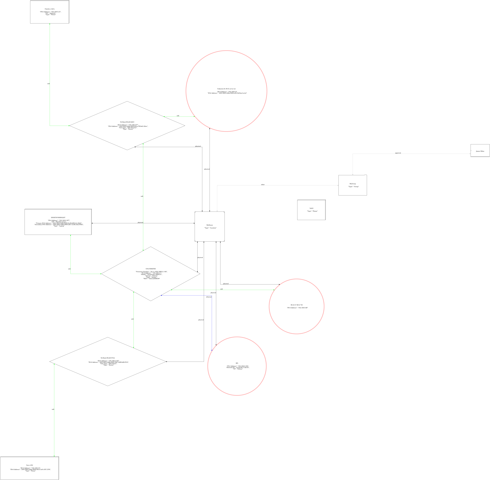

# networkMapper

Given a very simple formatted input file, produce a \*.png output file.

---

## Example

```
MyHouse has a Type of Location

CP2150RATND has a Type of Router
CP2150RATND has an "IPv4 Address" of 192.168.0.1
CP2150RATND is connected to MyHouse via Physical
CP2150RATND has a "Firmware Number" of "20.3.c.0501-MR22.1-RA"
CP2150RATND has a "Model" of "Technicolor DJA0231"
CP2150RATND has a "Telcom" of "Telstra"
CP2150RATND has a "WiFi" of "TelstraDD8ED9"
```



---

## License

BSD 3-Clause, see [LICENSE.md](LICENSE.md).
